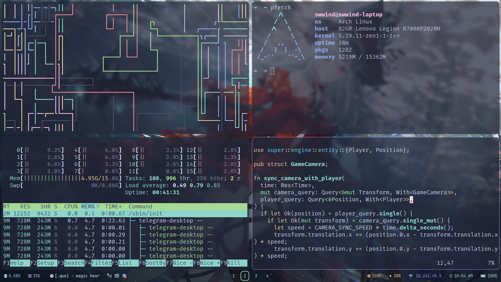

# swwind's Dotfiles

These are the basic dotfiles that I start with when I set up a new environment.

This is the hyprland branch.



## Installation

For **Manjaro/Arch Linux** users, you can just do as the following, 

```bash
git clone git@github.com:swwind/dotfiles.git .dotfiles
cd .dotfiles

./install-hyprland.sh
```
